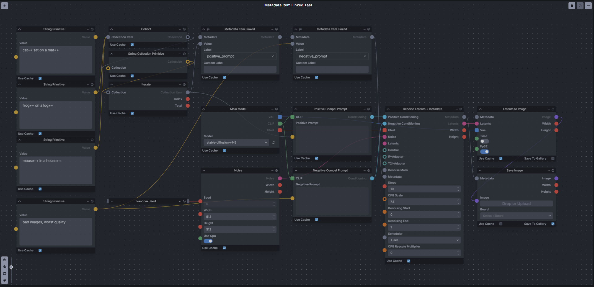

# `metadata-linked-nodes` for InvokeAI (v3.5+)
A set of InvokeAI nodes for Metadata. Collect Metadata from with an iterate node & Extract metadata from an image.

- `Metadata Item Linked` - Allows collecting of metadata while within iterate nodes with no need for collect nodes or conversion to metadata.
- `Metadata From Image` - Provides Metadata from an image.
- `Metadata To String` - Extracts a String value of a label from metadata.
- `Metadata To Integer` - Extracts an Integer value of a label from metadata.
- `Metadata To Float` - Extracts a Float value of a label from metadata.
- `Metadata To Scheduler` - Extracts a Scheduler value of a label from metadata.
- `Metadata To Bool` - Extracts Bool types from metadata
- `Metadata To Model` - Extracts model types from metadata. 
- `Metadata To SDXL Model` - Extracts SDXL model types from metadata
- `Metadata To LoRAs` - Extracts Loras from metadata. 
- `Metadata To SDXL LoRAs` - Extracts SDXL Loras from metadata
- `Metadata To ControlNets` - Extracts ControNets from metadata
- `Metadata To IP-Adapters` - Extracts IP-Adapters from metadata
- `Metadata To T2I-Adapters` - Extracts T2I-Adapters from metadata
- `Denoise Latents + Metadata` - This is an inherited version of the existing `Denoise Latents` node but with a metadata input and output. This will work in conjunction with the `metadata-linked` node.  It will provide metadata for most of the normal fields so you will only really need external metadata nodes for prompts and VAE. The following labels will be gathered from the denoise node:
  - seed
  - width
  - height
  - steps
  - cfg_scale
  - cfg_rescale
  - denoise_start
  - denoise_end
  - scheduler
  - model
  - controlnets
  - ipAdapters
  - t2iAdapters
  - loras

- added cfg_rescale_multiplier, model, VAE, seamless_x and seemless_y as built-in labels for the metadata_linked node.

## Usage
### <ins>Install</ins><BR>
There are two options to install the nodes:

1. **Recommended**: Git clone into the `invokeai/nodes` directory. This allows updating via `git pull`.

    - In the InvokeAI nodes folder, run:
    ```bash
    git clone https://github.com/skunkworxdark/metadata-linked-nodes.git
    ```

2. Manually download [metadata_linked.py](metadata_linked.py) & [__init__.py](__init__.py) then place them in a subfolder under `invokeai/nodes`. 

### <ins>Update</ins><BR>
Run a `git pull` from the `metadata-linked-nodes` folder.

Or run `update.bat`(windows) or `update.`sh`(Linux).

For manual installs, download and replace the files.

### <ins>Remove</ins><BR>
Delete the `metadata-linked-nodes` folder. Or rename it to `_metadata-linked-nodes`` so InvokeAI will ignore it.

## ToDo
- Add more metadata types
- More example workflows
# Example Usage

[metadata_from_image_workflow.json](workflows/metadata_from_image_workflow.json)

<BR>

[metadata_Item_linked_workflow.json](workflows/metadata_Item_linked_workflow.json)

<BR>

Denoise Latents + Metadata Example
